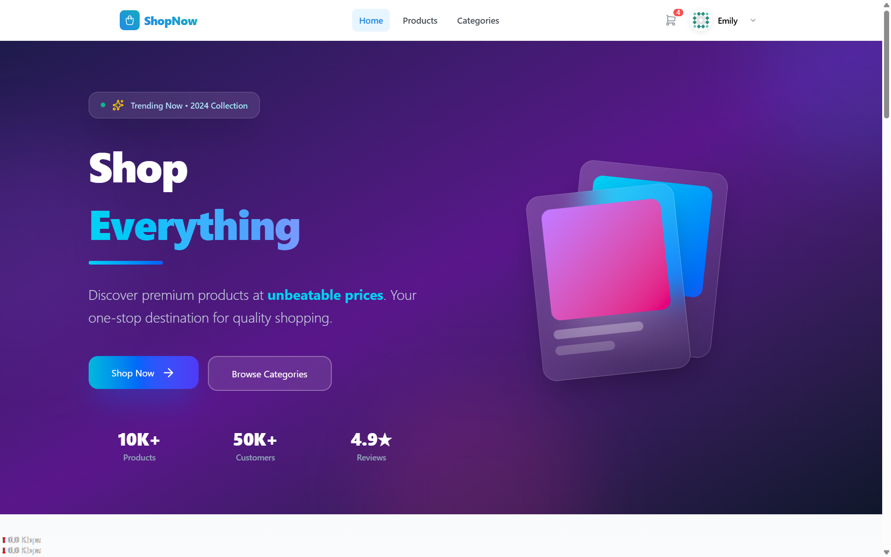
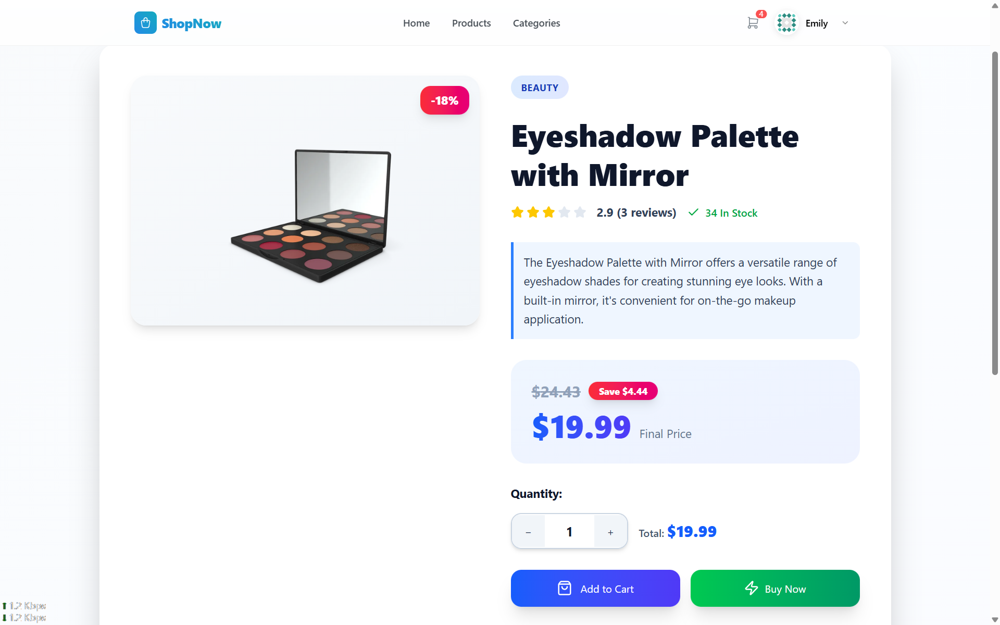
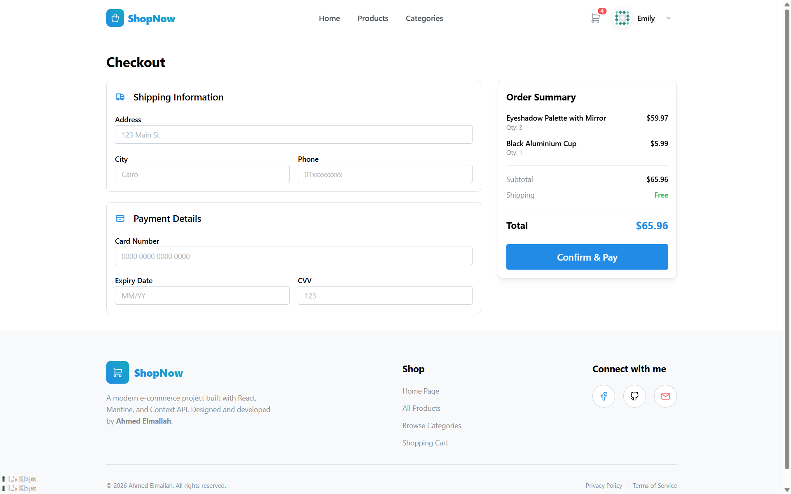
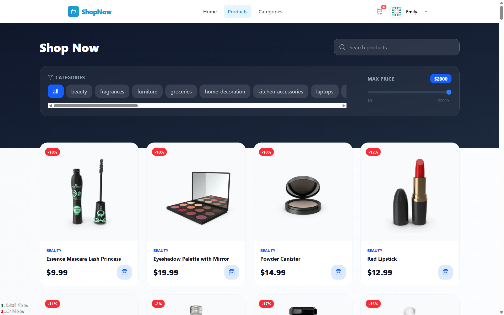

# 🛍️ ShopNow - Modern E-Commerce Application


A fully functional, responsive e-commerce frontend application built with **React** and **Mantine UI**. This project simulates a complete shopping experience, from browsing products to a smart checkout process, utilizing **DummyJSON API** for data and **Local Storage** for persistence.

🔗 **Live Demo:** [Click Here to Visit ShopNow](https://1-e-commerce-project.netlify.app/)

---

## 📸 Screenshots

| Home Page                       | Product Details                       |
| ------------------------------- | ------------------------------------- |
|  |  |

| Smart Checkout                          | AllProducts                                   |
| --------------------------------------- | --------------------------------------------- |
|  |  |

---

## ✨ Key Features

- **🛒 Advanced Cart System:** Add items, adjust quantities, and real-time total calculation.
- **⚡ Buy Now Logic:** Direct checkout flow for single items without affecting the main cart (using React Router state).
- **🔐 Authentication Simulation:** Guest mode vs. User mode (Login/Signup UI).
- **🛡️ Form Validation:** Robust checkout form validation using **Formik** & **Yup** (prevents invalid card numbers, phone formats, etc.).
- **🎨 Modern UI/UX:** Built with **Mantine UI**, featuring a glassmorphism navbar, toast notifications, and responsive layout.
- **🔍 Dynamic Routing:** Product details, categories, and protected routes for checkout.

---

## 🛠️ Tech Stack

- **Frontend Framework:** React (Vite)
- **Styling & UI:** Mantine UI, CSS Modules
- **State Management:** React Context API
- **Routing:** React Router DOM (v6)
- **Forms & Validation:** Formik, Yup
- **Notifications:** @mantine/notifications
- **Icons:** Tabler Icons, React Icons, Lucide React
- **API:** Axios (fetching data from DummyJSON)

---

## 🚀 How to Run Locally

Clone the project and install dependencies to start the development server.

```bash
# 1. Clone the repository
# 1. Clone the repository
git clone https://github.com/AhmedWaheedElmallah29/E-commerce.git

# 2. Navigate to project directory
cd E-commerce

# 3. Install dependencies
npm install

# 4. Start the server
npm run dev
```
